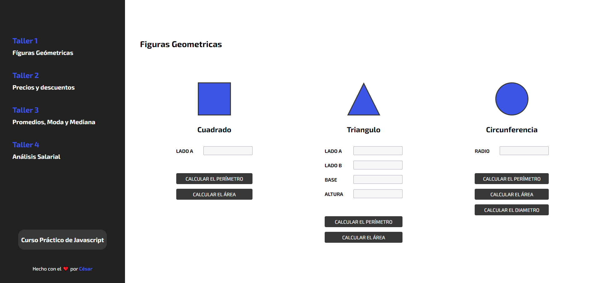
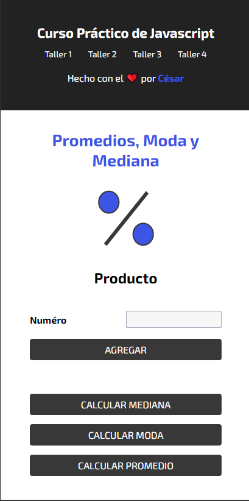

# Proyecto Curso Práctico de Javascript

### Funciones de la Aplicación
Esta aplicación pone en práctica lo aprendido de Javascript en el [Curso Práctico de Javascript](https://platzi.com/clases/javascript-practico/) de Platzi.

Para hacerlo aun mas divertido, junte todo lo aprendido, en un archivo index.html, donde se puede previsualizar todos los talleres, para poder curiosar lo visto en clases.

## Taller #1: Figuras geométricas

- Primer paso: Definir las fórmulas
- Segundo paso: Immplementar la fórmulas en JavaScript 
- Tercer paso: Crear funciones
- Cuarto paso: Integrar JS con HTML

## Taller #2: Porcentajes y descuentos

- Primer paso: Definir las fórmulas
- Segundo paso: Immplementar la fórmulas en JavaScript 
- Tercer paso: Crear funciones
- Cuarto paso: Integrar JS con HTML

## Taller #3: Promedio, mediana y moda

- Primer paso: Definir las fórmulas
- Segundo paso: Immplementar la fórmulas en JavaScript 
- Tercer paso: Crear funciones
- Cuarto paso: Integrar JS con HTML

## Taller #4: Análisis Salarial

- Primer paso: Definir las fórmulas
- Segundo paso: Immplementar la fórmulas en JavaScript 
- Tercer paso: Crear funciones
- Cuarto paso: Integrar JS con HTML

# Screenshot de la Aplicación
## **Index** :computer:

 